# DuoPulse v4: Visual Guide 🥁

> An **algorithmic drum sequencer** for Daisy Patch.init() that prioritizes musicality, playability, and deterministic variation.

---

## 🎯 Core Philosophy

```
┌─────────────────────────────────────────────────────────────────────┐
│                                                                     │
│   "Every output should be danceable. No probability soup."          │
│                                                                     │
│   ✓ Musicality over flexibility                                     │
│   ✓ Controls map to musical intent                                  │
│   ✓ Same settings = identical output (deterministic)                │
│   ✓ Hit budgets, not coin flips                                     │
│                                                                     │
└─────────────────────────────────────────────────────────────────────┘
```

**Target Genres:** Techno • Tribal/Broken Techno • IDM/Glitch

---

## 📊 I/O At a Glance

### Outputs

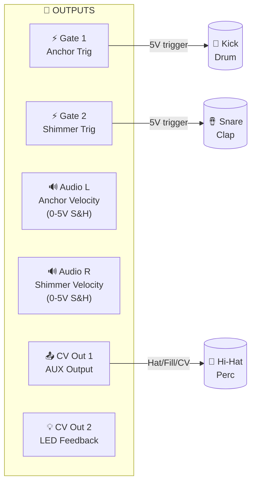

### Inputs

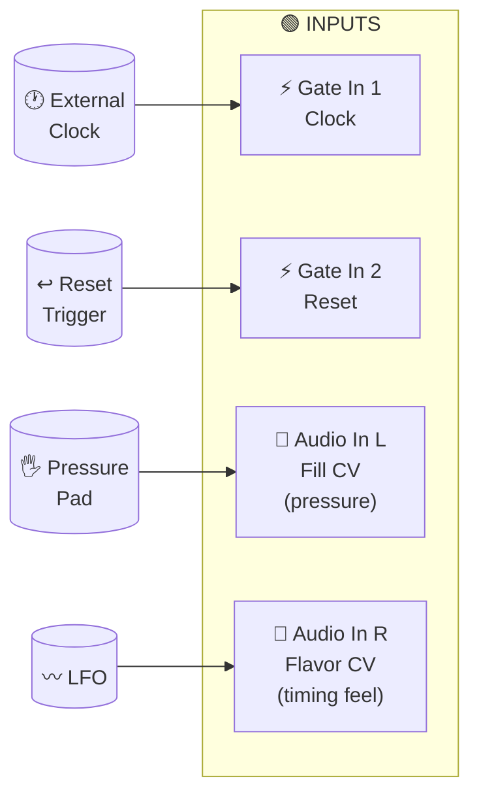

---

## 🎛️ Control Layout

### Performance Mode (Switch Up ⬆️)

Each knob controls a **conceptual domain** with related primary/shift functions:

```
╔═══════════════════════════════════════════════════════════════════════════╗
║                         PERFORMANCE MODE                                   ║
╠═══════════╦═══════════════════════════╦═══════════════════════════════════╣
║   KNOB    ║      PRIMARY (CV-able)    ║         + SHIFT                   ║
╠═══════════╬═══════════════════════════╬═══════════════════════════════════╣
║           ║                           ║                                   ║
║    K1     ║  🔥 ENERGY                ║  💪 PUNCH                         ║
║ INTENSITY ║  "how many hits"          ║  "how hard those hits are"        ║
║           ║  └── hit density          ║  └── velocity dynamics            ║
║           ║                           ║                                   ║
╠═══════════╬═══════════════════════════╬═══════════════════════════════════╣
║           ║                           ║                                   ║
║    K2     ║  📈 BUILD                 ║  🎭 GENRE                         ║
║   DRAMA   ║  "how dramatic"           ║  "what style of drama"            ║
║           ║  └── phrase arc           ║  └── Techno/Tribal/IDM            ║
║           ║                           ║                                   ║
╠═══════════╬═══════════════════════════╬═══════════════════════════════════╣
║           ║                           ║                                   ║
║    K3     ║  ↔️ FIELD X               ║  🌊 DRIFT                         ║
║  PATTERN  ║  "where in grid"          ║  "how it changes"                 ║
║           ║  └── syncopation          ║  └── evolution rate               ║
║           ║                           ║                                   ║
╠═══════════╬═══════════════════════════╬═══════════════════════════════════╣
║           ║                           ║                                   ║
║    K4     ║  ↕️ FIELD Y               ║  ⚖️ BALANCE                       ║
║  TEXTURE  ║  "how complex"            ║  "which voice dominates"          ║
║           ║  └── complexity           ║  └── anchor vs shimmer            ║
║           ║                           ║                                   ║
╚═══════════╩═══════════════════════════╩═══════════════════════════════════╝
```

### Config Mode (Switch Down ⬇️)

Domain-based organization for settings:

```
╔═══════════════════════════════════════════════════════════════════════════╗
║                           CONFIG MODE                                      ║
╠═══════════╦═══════════════════════════╦═══════════════════════════════════╣
║   KNOB    ║         PRIMARY           ║         + SHIFT                   ║
╠═══════════╬═══════════════════════════╬═══════════════════════════════════╣
║    K1     ║  📐 PATTERN LENGTH        ║  📏 PHRASE LENGTH                 ║
║   GRID    ║     16/24/32/64 steps     ║     1/2/4/8 bars                  ║
╠═══════════╬═══════════════════════════╬═══════════════════════════════════╣
║    K2     ║  🎵 SWING                 ║  ⏱️ CLOCK DIV                     ║
║  TIMING   ║     0-100%                ║     1/2/4/8                       ║
╠═══════════╬═══════════════════════════╬═══════════════════════════════════╣
║    K3     ║  📡 AUX MODE              ║  📊 AUX DENSITY                   ║
║  OUTPUT   ║  Hat/Fill/Phrase/Event    ║     50%/100%/150%/200%            ║
╠═══════════╬═══════════════════════════╬═══════════════════════════════════╣
║    K4     ║  ↩️ RESET MODE            ║  🔗 VOICE COUPLING                ║
║ BEHAVIOR  ║  Phrase/Bar/Step          ║  Independent/Interlock/Shadow     ║
╚═══════════╩═══════════════════════════╩═══════════════════════════════════╝
```

---

## 🏗️ Architecture Overview

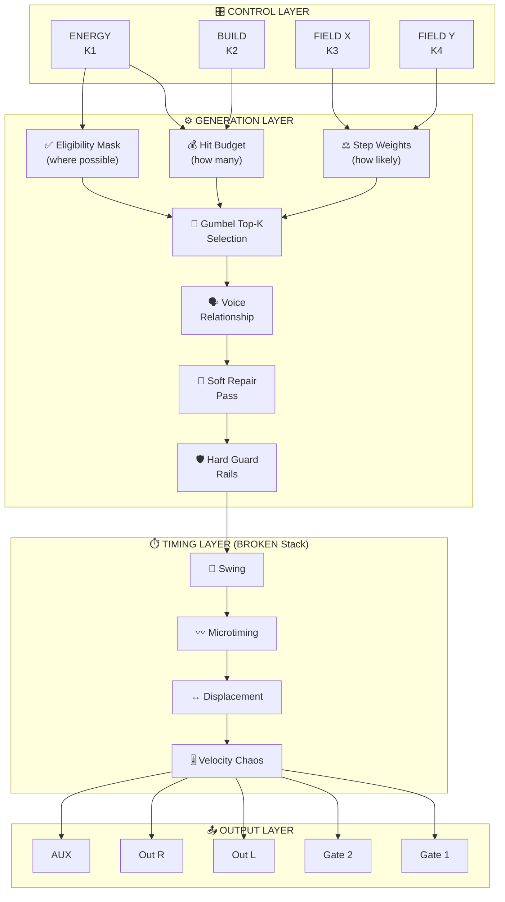

---

## 🗺️ Pattern Field System

### The 3×3 Archetype Grid

Navigate a 2D space of musical patterns using FIELD X and FIELD Y:

```
                         Y: COMPLEXITY
                              ↑
                              │
              complex    ┌────┴────┬──────────┬──────────┐
                 2       │ [0,2]   │  [1,2]   │  [2,2]   │
                         │  BUSY   │ POLYRHYTHM│  CHAOS   │
                         │ 16ths   │  3-vs-4  │ glitchy  │
                         ├─────────┼──────────┼──────────┤
                 1       │ [0,1]   │  [1,1]   │  [2,1]   │
                         │ DRIVING │  GROOVY  │  BROKEN  │
                         │ 8ths    │  swing   │ displaced│
                         ├─────────┼──────────┼──────────┤
              sparse     │ [0,0]   │  [1,0]   │  [2,0]   │
                 0       │ MINIMAL │  STEADY  │ DISPLACED│
                         │ kicks   │  groove  │ off-grid │
                         └─────────┴──────────┴──────────┘
                              0          1          2
                           straight  syncopated   broken
                                  X: SYNCOPATION ──────→
```

### Winner-Take-More Blending

When you're between grid points, patterns blend with the **dominant** archetype having more influence:

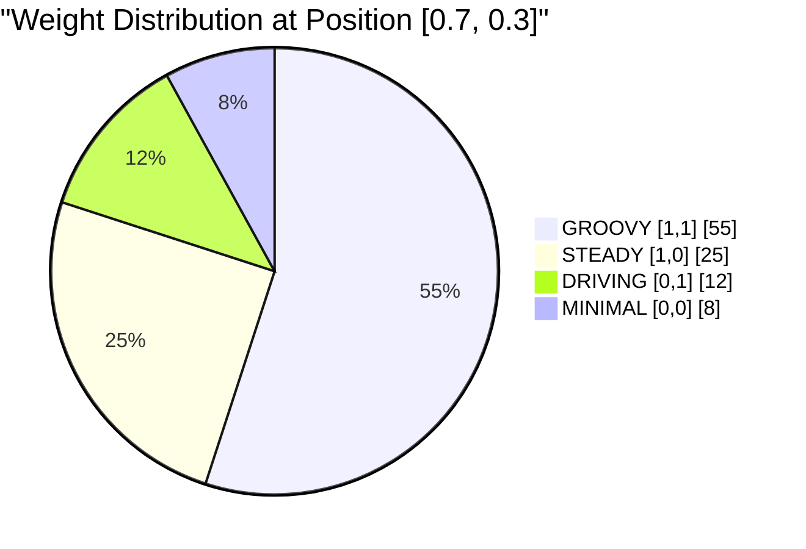

---

## 🔥 Energy Zones

ENERGY doesn't just scale density—it changes behavioral rules:

```
 ENERGY
   │
 100%  ┌───────────────────────────────────────┐
       │            🔴 PEAK                    │
       │   • Maximum activity                  │
       │   • Ratchets allowed                  │
  75%  │   • All voices busy                   │
       ├───────────────────────────────────────┤
       │           🟠 BUILD                    │
       │   • Increasing ghosts                 │
       │   • Phrase-end fills                  │
  50%  │   • AUX active                        │
       │   • Timing loosens                    │
       ├───────────────────────────────────────┤
       │           🟢 GROOVE                   │
       │   • Stable, danceable                 │
       │   • Locked pattern                    │
  20%  │   • Moderate fills                    │
       │   • Tight timing                      │
       ├───────────────────────────────────────┤
       │           🔵 MINIMAL                  │
       │   • Sparse skeleton                   │
   0%  │   • Large gaps allowed                │
       │   • Tight timing                      │
       └───────────────────────────────────────┘
```

---

## 💪 PUNCH: Velocity Dynamics

PUNCH controls the contrast between loud and soft hits:

```
PUNCH = 0%:   ████████████████  All hits ~70% (flat, machine-like)
              ●●●●●●●●

PUNCH = 50%:  ████  ████  ████  Accents ~85%, normal ~55%
              ●○●○●○●○          (natural groove)

PUNCH = 100%: ██        ██      Accents ~95%, ghosts ~30%
              ●  ●      ●       (punchy, aggressive)
```

```mermaid
xychart-beta
    title "Velocity Distribution by PUNCH Setting"
    x-axis ["0%", "25%", "50%", "75%", "100%"]
    y-axis "Velocity %" 0 --> 100
    bar "Accent Velocity" [80, 85, 90, 93, 95]
    bar "Normal Velocity" [70, 60, 55, 45, 30]
```

---

## 📈 BUILD: Phrase Arc

BUILD controls narrative tension over the phrase:

```
                    BUILD = 0% (flat)
Density  ────────────────────────────────────────
         ████████████████████████████████████████
         Bar 1    Bar 2    Bar 3    Bar 4


                    BUILD = 50% (subtle)
Density  ────────────────────────────────────▲▲▲▲
         ████████████████████████████████████████
         Bar 1    Bar 2    Bar 3    Bar 4 (fills)


                    BUILD = 100% (dramatic)
Density  ────────────────────▲▲▲▲▲▲▲▲████████████
         ████████▲▲▲▲▲▲▲▲▲▲▲▲▲▲▲▲▲▲▲▲████████████
         Bar 1    Bar 2    Bar 3    Bar 4 (release)
                            (tension builds)
```

**What BUILD affects:**
- 📈 Density multiplier (more hits toward end)
- 🥁 Fill probability and intensity
- ⭐ Accent probability increase
- 〰️ Timing looseness (more humanization)
- 🎩 AUX lane activity boost

---

## 🎲 Generation Pipeline

### Step-by-Step Bar Generation

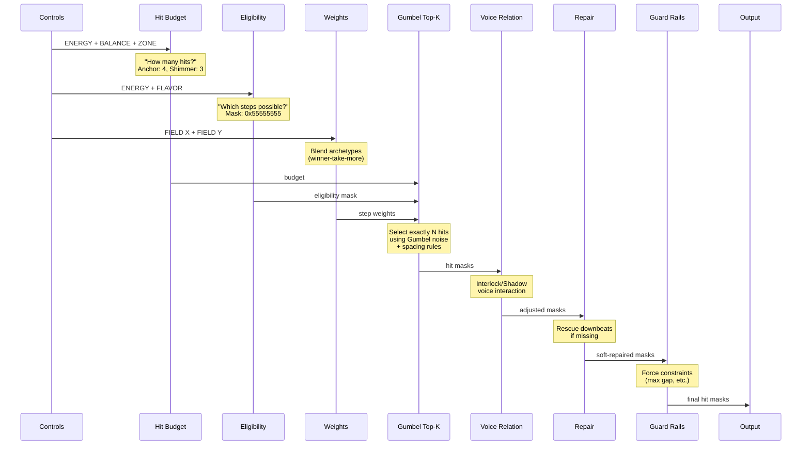

### Gumbel Top-K Selection (No More Coin Flips!)

Instead of random coin flips that can produce clumps or silence:

```
Traditional (BAD):        Gumbel Top-K (GOOD):
                          
For each step:            Target: 4 hits
  if random < prob:       
    HIT                   score[i] = log(weight[i]) + noise
  else:                   
    MISS                  Select top 4 scores
                          (with spacing penalty)
                          
Result: 0-16 hits         Result: exactly 4 hits
(unpredictable!)          (guaranteed density!)
```

---

## ⏱️ BROKEN Timing Stack

Four layers of timing variation, all bounded by Energy Zone:

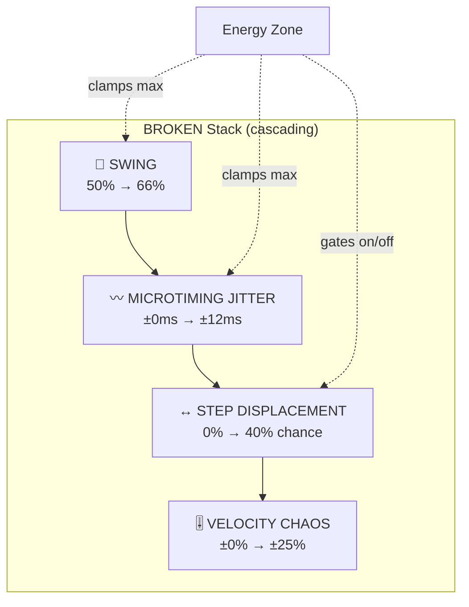

### Zone Limits Table

| Layer | BROKEN 0% | BROKEN 100% | GROOVE Zone Max | PEAK Zone Max |
|-------|-----------|-------------|-----------------|---------------|
| **Swing** | 50% (straight) | 66% (triplet) | 58% | No limit |
| **Jitter** | ±0ms | ±12ms | ±3ms | ±12ms |
| **Displacement** | Never | 40% chance | Never | ±2 steps |
| **Velocity Chaos** | ±0% | ±25% | ±25% | ±25% |

---

## 🛡️ Guard Rails

Hard rules that guarantee musicality:

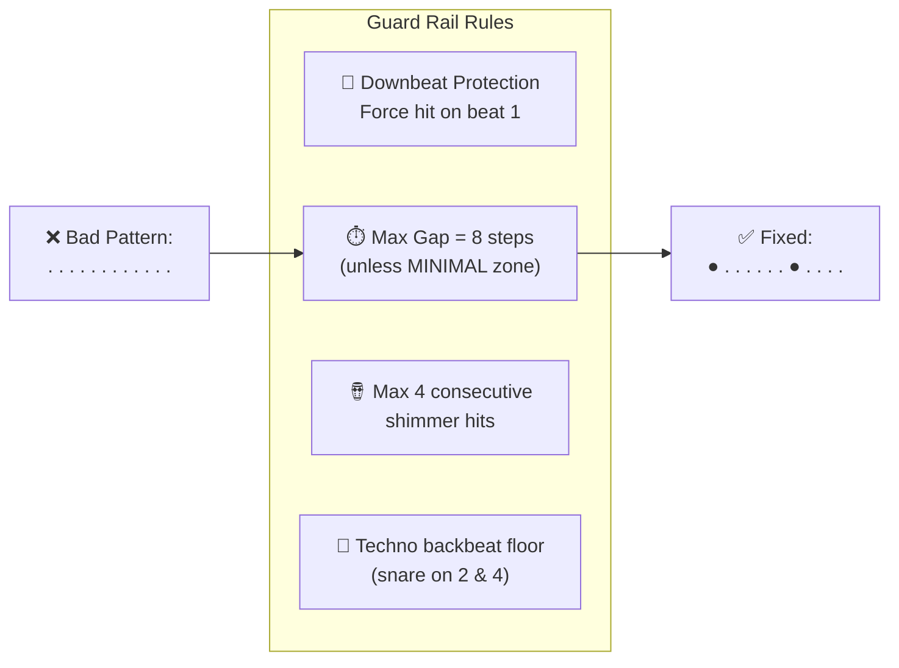

---

## 🔗 Voice Coupling Modes

How Anchor and Shimmer interact:

```
INDEPENDENT (0-33%):
  Anchor:  ● . ● . ● . ● .
  Shimmer: . ● . ● . ● . ●    ← Can overlap freely
  
INTERLOCK (33-67%):
  Anchor:  ● . . . ● . . .
  Shimmer: . . ● . . . ● .    ← Suppress simultaneous, call-response
  
SHADOW (67-100%):
  Anchor:  ● . . . ● . . .
  Shimmer: . ● . . . ● . .    ← Shimmer echoes anchor +1 step
```

---

## 🌊 DRIFT: Controlled Evolution

DRIFT controls which parts of the pattern can change phrase-to-phrase:

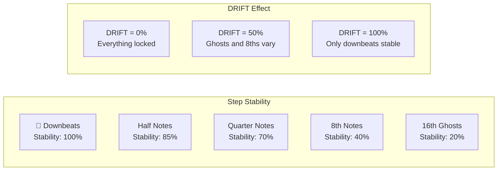

```
DRIFT = 0%:   Same pattern every phrase (live performance lock)
DRIFT = 50%:  Ghosts & 8ths vary, core groove stable
DRIFT = 100%: Maximum evolution, only downbeats guaranteed
```

---

## 📡 AUX Output Modes

When external clock is patched, AUX can be:

| Mode | Output | Use Case |
|------|--------|----------|
| 🎩 **HAT** | Third trigger voice | Hi-hats, percussion |
| 🚨 **FILL_GATE** | High during fills | Trigger FX on builds |
| 📈 **PHRASE_CV** | 0-5V ramp over phrase | Modulate filter/FX |
| ⚡ **EVENT** | Trigger on "moments" | Sync to accents/sections |

```mermaid
gantt
    title Phrase CV Mode Output
    dateFormat X
    axisFormat %s
    
    section Phrase
    Bar 1 :0, 4
    Bar 2 :4, 4
    Bar 3 :8, 4
    Bar 4 :12, 4
    
    section CV Output
    0V → 5V ramp :0, 16
```

---

## 🎭 Control Interaction Matrix

### ENERGY × BUILD

```
                    Low BUILD              High BUILD
                 (static phrase)        (dramatic arc)
                ┌─────────────────────┬─────────────────────┐
    Low ENERGY  │  🧘 Minimal         │  🌊 Subtle swells   │
    (sparse)    │  Hypnotic, locked   │  Gentle fills       │
                ├─────────────────────┼─────────────────────┤
    High ENERGY │  🚂 Dense, driving  │  🌋 Climactic       │
    (busy)      │  Relentless         │  Big builds & drops │
                └─────────────────────┴─────────────────────┘
```

### PUNCH × DRIFT

```
                    Low PUNCH              High PUNCH
                 (flat dynamics)        (punchy dynamics)
                ┌─────────────────────┬─────────────────────┐
    Low DRIFT   │  🤖 Robotic         │  💥 Punchy, locked  │
    (locked)    │  Machine loop       │  Consistent groove  │
                ├─────────────────────┼─────────────────────┤
    High DRIFT  │  🌫️ Evolving        │  🥁 Human drummer   │
    (evolving)  │  Shifting textures  │  Alive, expressive  │
                └─────────────────────┴─────────────────────┘
```

---

## 🎬 Performance Scenarios

### Building to a Drop

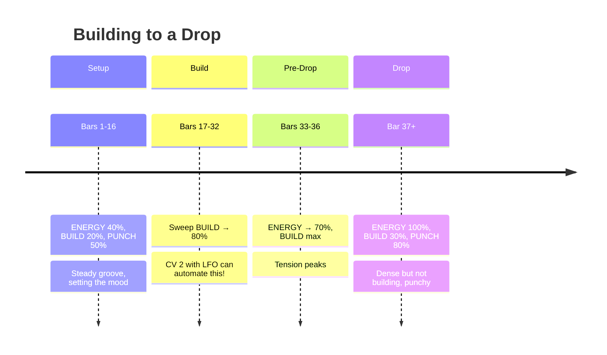

### Evolving Texture (Patched Modulation)

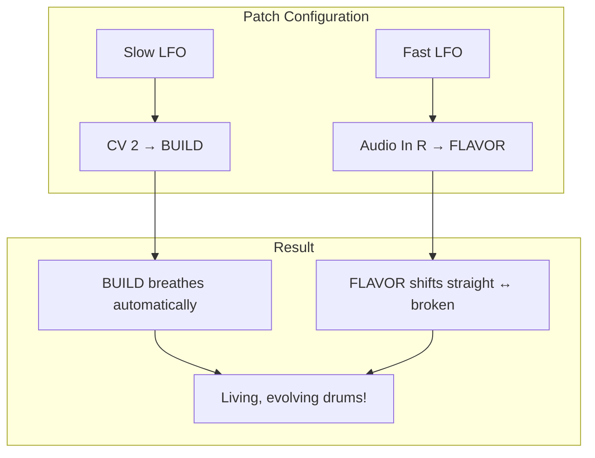

---

## 💡 LED Feedback

Single dimmable LED communicates state through brightness:

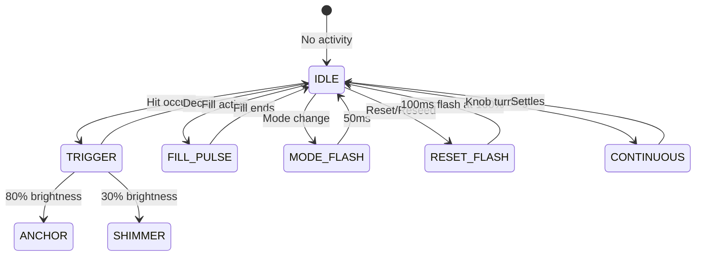

| Brightness | Meaning |
|------------|---------|
| 0% | Off (idle) |
| 30% | Shimmer trigger |
| 80% | Anchor trigger |
| 100% flash | Reset/reseed/mode change |
| Pulsing | Live fill mode |
| Gradient | Continuous parameter adjustment |

---

## 💾 Persistence

### What Gets Saved (Auto-save with 2s debounce)

| Category | Parameters |
|----------|------------|
| **Config Primary** | Pattern length, swing, AUX mode, reset mode |
| **Config Shift** | Phrase length, clock div, aux density, voice coupling |
| **Performance Shift** | Genre |
| **Pattern Seed** | Current seed (survives power cycles) |

### What's Read from Knobs on Boot

- ENERGY, BUILD, FIELD X, FIELD Y
- PUNCH, DRIFT, BALANCE
- FLAVOR (from Audio In R)

---

## 🎼 Quick Reference Card

```
╔═══════════════════════════════════════════════════════════════════════════╗
║                        DUOPULSE v4 QUICK REFERENCE                        ║
╠═══════════════════════════════════════════════════════════════════════════╣
║                                                                           ║
║  PERFORMANCE MODE (Switch Up)                                             ║
║  ─────────────────────────────                                            ║
║  K1: ENERGY (density)         │ +Shift: PUNCH (dynamics)                  ║
║  K2: BUILD (phrase arc)       │ +Shift: GENRE (Techno/Tribal/IDM)         ║
║  K3: FIELD X (syncopation)    │ +Shift: DRIFT (evolution)                 ║
║  K4: FIELD Y (complexity)     │ +Shift: BALANCE (voice ratio)             ║
║                                                                           ║
║  CONFIG MODE (Switch Down)                                                ║
║  ─────────────────────────────                                            ║
║  K1: Pattern Length 16/24/32/64  │ +Shift: Phrase Length 1/2/4/8 bars     ║
║  K2: Swing 0-100%                │ +Shift: Clock Div 1/2/4/8              ║
║  K3: AUX Mode                    │ +Shift: AUX Density                    ║
║  K4: Reset Mode                  │ +Shift: Voice Coupling                 ║
║                                                                           ║
║  BUTTON                                                                   ║
║  ──────                                                                   ║
║  Tap:        Queue fill for next phrase                                   ║
║  Hold:       Shift modifier                                               ║
║  Double-tap: Reseed pattern                                               ║
║                                                                           ║
║  CV INPUTS (modulate primary controls)                                    ║
║  ──────────────────────────────────────                                   ║
║  CV 1 → ENERGY   │  CV 2 → BUILD   │  CV 3 → FIELD X   │  CV 4 → FIELD Y  ║
║                                                                           ║
║  AUDIO INPUTS                                                             ║
║  ─────────────                                                            ║
║  Audio In L: Fill CV (gate + pressure)                                    ║
║  Audio In R: Flavor CV (timing feel: straight ↔ broken)                   ║
║                                                                           ║
╚═══════════════════════════════════════════════════════════════════════════╝
```

---

## 📚 Glossary

| Term | Definition |
|------|------------|
| **Anchor** | Primary voice (kick-like) |
| **Shimmer** | Secondary voice (snare-like) |
| **AUX** | Third voice (hi-hat/perc) |
| **Hit Budget** | Guaranteed number of hits per bar |
| **Eligibility Mask** | Which steps *can* fire |
| **Gumbel Top-K** | Deterministic weighted selection |
| **BROKEN Stack** | Swing + jitter + displacement + velocity chaos |
| **Guard Rails** | Hard rules ensuring musicality |
| **Archetype** | One of 9 curated pattern templates per genre |
| **Pattern Field** | 3×3 grid navigated by FIELD X/Y |

---

*This visual guide was generated from the DuoPulse v4 specification.*
