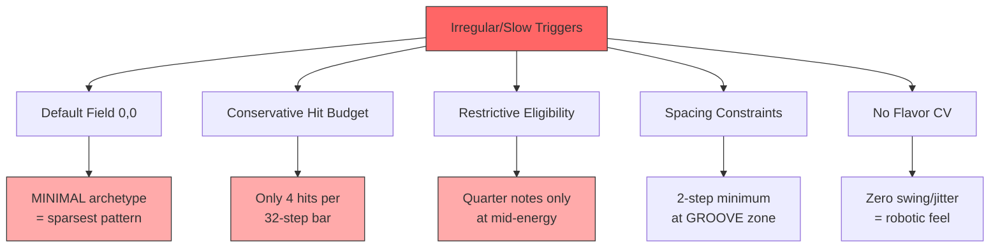
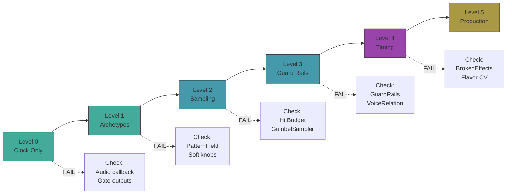
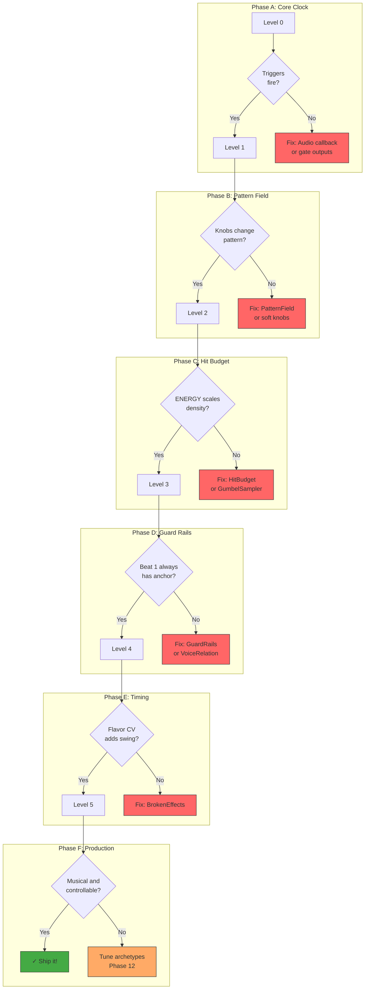
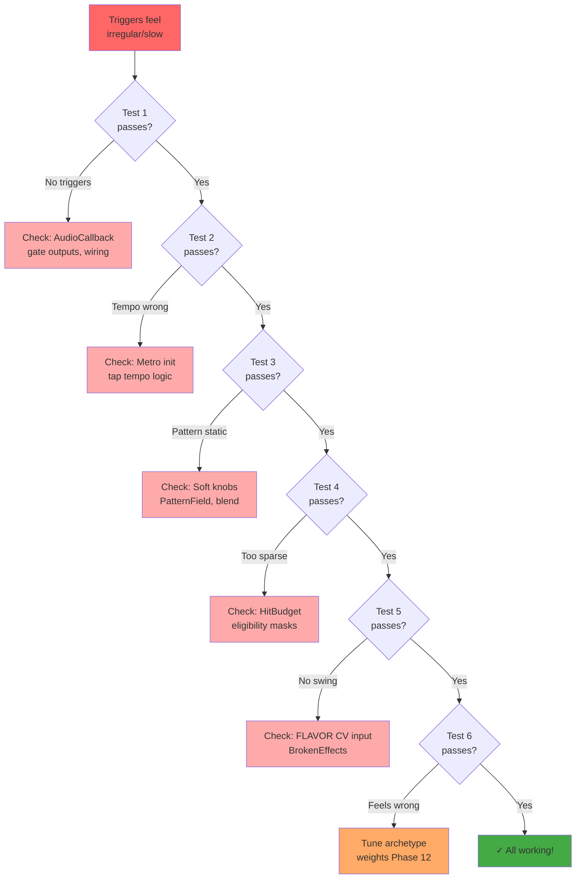

# Task 16: DuoPulse v4 Hardware Validation & Debug

**Status**: IN PROGRESS  
**Branch**: `feature/duopulse-v4`  
**Spec Reference**: docs/specs/main.md sections 4-11

---

## 🎛️ Hardware Reference

### Patch.Init Panel Layout

```
┌─────────────────────────────────────────────────────┐
│                    PATCH.INIT                       │
├─────────────────────────────────────────────────────┤
│                                                     │
│        ┌───┐  ┌───┐                                │
│        │K1 │  │K2 │       ← TOP ROW KNOBS          │
│        └───┘  └───┘                                │
│       ENERGY  BUILD                                 │
│                                                     │
│        ┌───┐  ┌───┐                                │
│        │K3 │  │K4 │       ← BOTTOM ROW KNOBS       │
│        └───┘  └───┘                                │
│       FIELD   FIELD                                 │
│         X       Y                                   │
│                                                     │
│   ○ CV1  ○ CV2  ○ CV3  ○ CV4   ← CV INPUTS        │
│                                                     │
│   ○ GATE1  ○ GATE2             ← GATE INPUTS       │
│   (Clock)  (Reset)                                  │
│                                                     │
│   ● GATE1  ● GATE2             ← GATE OUTPUTS      │
│   (Anchor) (Shimmer)                                │
│                                                     │
│   ○ AUD L  ○ AUD R             ← AUDIO INPUTS      │
│   (Fill)   (Flavor)                                 │
│                                                     │
│   ● AUD L  ● AUD R             ← AUDIO OUTPUTS     │
│   (Anchor  (Shimmer                                 │
│    Vel)    Vel)                                     │
│                                                     │
│   [B7]  [B8]                   ← BUTTONS           │
│   Shift  Mode                                       │
│   Layer  Switch                                     │
│                                                     │
│   ● CV1   ● CV2                ← CV OUTPUTS        │
│   (AUX)   (LED)                                     │
│                                                     │
└─────────────────────────────────────────────────────┘
```

### Knob Layout (2×2 Grid)

```
        ┌─────────────────────┐
        │   ┌───┐     ┌───┐   │
        │   │K1 │     │K2 │   │  ← Top Row
        │   └───┘     └───┘   │
        │  ENERGY     BUILD   │
        │                     │
        │   ┌───┐     ┌───┐   │
        │   │K3 │     │K4 │   │  ← Bottom Row
        │   └───┘     └───┘   │
        │  FIELD X   FIELD Y  │
        └─────────────────────┘
```

### Control Modes

```
           ┌─────────────────────────────────────────┐
           │         MODE SWITCH (B8)                │
           ├───────────────────┬─────────────────────┤
           │    DOWN = PERF    │     UP = CONFIG     │
           ├───────────────────┼─────────────────────┤
 Normal    │ K1: ENERGY        │ K1: Pattern Length  │
           │ K2: BUILD         │ K2: Swing           │
           │ K3: FIELD X       │ K3: AUX Mode        │
           │ K4: FIELD Y       │ K4: Reset Mode      │
           ├───────────────────┼─────────────────────┤
 +Shift    │ K1: PUNCH         │ K1: Phrase Length   │
 (hold B7) │ K2: GENRE         │ K2: Clock Div       │
           │ K3: DRIFT         │ K3: AUX Density     │
           │ K4: BALANCE       │ K4: Voice Coupling  │
           └───────────────────┴─────────────────────┘
```

---

## Problem Statement

Initial hardware testing revealed triggers feel "irregular and slow" with unpredictable control response.

### Root Causes Identified



### Fixes Applied

1. Updated default control values in `main.cpp`:
   - `fieldX = 0.5, fieldY = 0.33` (Groovy archetype instead of Minimal)
   - `energy = 0.6` (Higher in GROOVE zone for more hits)

2. Added debug compile flags in `config.h`:
   - `DEBUG_BASELINE_MODE` - Forces known-good values
   - `DEBUG_SIMPLE_TRIGGERS` - Bypasses generation, simple 4-on-floor
   - `DEBUG_FIXED_SEED` - Reproducible patterns
   - `DEBUG_FEATURE_LEVEL` (0-5) - Progressive feature enablement

---

## 🔄 Iterative Testing Methodology

**This document is a living test plan.** Hardware testing often reveals issues that require immediate code changes. The workflow is:

1. **Run test** → Observe behavior
2. **Document findings** → Note what works, what doesn't
3. **Modify code** → Fix issues as you discover them
4. **Re-test** → Verify the fix works
5. **Update this document** → Record changes made and new expected behavior

### Important Notes

- **Expect to modify code during testing** - this is normal and expected
- **Always rebuild and reflash** after code changes: `make clean && make && make program-dfu`
- **Keep notes in the Test Log** section at the bottom
- Tests build on each other - don't advance to Level N+1 until Level N passes

---

## 🛠️ Test 0: Pre-Test Modifications

This section documents simplifications made to reduce complexity before hardware testing.

### Modification 0.1: Remove Tap Tempo (2024-12-20)

**Problem**: Button B7 was handling tap tempo, shift layer, and double-tap reseed. This complex state machine made debugging difficult and button behavior felt erratic.

**Changes Made**:
- **Removed tap tempo** - Internal clock runs at fixed 120 BPM (external clock via Gate In 1 still works)
- **Removed double-tap reseed** - Simplifies button logic
- **B7 is now shift-only** - Hold >100ms to activate shift layer, release to deactivate

**Files Modified**:
- `src/main.cpp` - Simplified button handling logic
- `inc/config.h` - DEBUG_FEATURE_LEVEL set to 0

**Expected Behavior After This Change**:
- B7 button: Hold to access shift layer, release returns to normal
- No tap tempo - tempo is fixed at 120 BPM internal clock
- External clock (Gate In 1) still works for tempo sync

**Build and Flash**:
```bash
make clean && make && make program-dfu
```

---

### Modification 0.2: Simplify LED Feedback (2024-12-20)

**Problem**: LED system was complex with multiple modes, making it hard to debug basic sequencer behavior.

**Changes Made**:
- **Simplified LED logic** - Removed complex LedIndicator state machine
- **Config mode**: LED solid on (100% brightness)
- **Anchor trigger (Gate Out 1)**: LED 50% brightness
- **Shimmer trigger (Gate Out 2)**: LED 30% brightness
- **Otherwise**: LED off

**Files Modified**:
- `src/main.cpp` - Replaced LedIndicator with simple brightness logic

**Expected Behavior After This Change**:
- Flip B8 switch UP → LED solid on (config mode)
- Flip B8 switch DOWN → LED blinks with triggers (performance mode)
- Gate Out 1 fires → LED at 50% brightness
- Gate Out 2 fires → LED at 30% brightness

**Switch Direction Confirmed**:
- **B8 UP** = Config mode (LED solid on)
- **B8 DOWN** = Performance mode (LED blinks with triggers)

**Build and Flash**:
```bash
make clean && make && make program-dfu
```

---

## 🧪 Part 1: Hardware Testing

### Test Flow Overview



---

### Test 1: Basic Clock & Triggers (Level 0)

**Goal**: Verify the audio callback runs and triggers fire at the correct tempo.

**What you'll hear**: A simple "four-on-floor" kick pattern with snare on 2 and 4.

#### Setup

Open `inc/config.h` and find the `DEBUG_FEATURE_LEVEL` line. Set it to 0:

```cpp
#define DEBUG_FEATURE_LEVEL 0
```

Then build and flash:

```bash
make clean && make && make program-dfu
```

#### Expected Pattern

```
Step:    1 2 3 4 5 6 7 8 9 ...16  17...24  25...32
         ┌─────────────────────────────────────────
Anchor:  ● . . . . . . . ● . . .  ● . . .  ● . . .
Shimmer: . . . . . . . . ● . . .  . . . .  ● . . .
Aux:     ● . ● . ● . ● . ● . ● .  ● . ● .  ● . ● .
         └─────────────────────────────────────────
         ↑beat1   ↑beat2   ↑beat3   ↑beat4
```

#### Knob Positions (ignored at Level 0)

At Level 0, the knobs don't affect the pattern. The simple 4-on-floor runs regardless of knob positions.


```
        ┌─────────────────────┐
        │   ┌───┐     ┌───┐   │
        │   │ · │     │ · │   │  Any position
        │   └───┘     └───┘   │  is fine!
        │    K1        K2     │
        │                     │
        │   ┌───┐     ┌───┐   │
        │   │ · │     │ · │   │  Knobs are
        │   └───┘     └───┘   │  ignored at
        │    K3        K4     │  Level 0
        └─────────────────────┘
```

#### Checklist

**Switch & LED Tests**:
- [ ] B8 switch UP → LED solid on (config mode)
- [ ] B8 switch DOWN → LED blinks with triggers (performance mode)

**Performance Mode (B8 DOWN)**:
- [ ] LED blinks at regular tempo (~120 BPM = 2 Hz for quarter notes)
- [ ] LED at 50% brightness when Gate Out 1 fires
- [ ] LED at 30% brightness when Gate Out 2 fires
- [ ] Gate Out 1 fires on every beat (4 times per bar)
- [ ] Gate Out 2 fires on beats 2 and 4 only
- [ ] Audio Out L holds ~5V after each anchor trigger
- [ ] Audio Out R holds ~5V after each shimmer trigger

**Button Test**:
- [ ] B7 button: Hold to activate shift layer (no tap tempo)

---

### Test 2: External Clock & Reset (Level 0)

**Goal**: Verify external clock sync and reset work correctly.

Same config as Test 1 (Level 0).

**Note**: Tap tempo has been removed. Tempo is fixed at 120 BPM internal clock or follows external clock.

#### External Clock Test

1. Patch a clock source (16th notes) to Gate In 1
2. Module should sync to external clock within a few pulses
3. Stop external clock → module should return to internal 120 BPM after ~2 seconds

#### Reset Test

1. Patch a trigger/gate to Gate In 2
2. When gate goes high, pattern should restart from step 1

#### Shift Button Test

1. Hold B7 for >100ms → shift layer should activate (LED may change behavior)
2. Release B7 → returns to normal mode
3. Short taps on B7 do nothing (tap tempo removed)

---

### Test 3: Archetype Patterns (Level 1)

**Goal**: Verify the Pattern Field responds to FIELD X and FIELD Y knobs (K3 and K4).

#### Setup

```cpp
#define DEBUG_FEATURE_LEVEL 1
```

Build and flash. Now the archetype patterns are active, but no hit budget/sampling—patterns come directly from archetype weight tables.

#### The Pattern Grid

The bottom two knobs (K3 and K4) navigate a 3×3 grid of pattern archetypes:

```
        FIELD Y (K4 - Complexity)
            ↑
        2   ┌───────┬───────┬───────┐
            │ Busy  │ Poly  │ Chaos │
            │       │rhythm │       │
        1   ├───────┼───────┼───────┤
            │Driving│ GROOVY│ Broken│  ← Sweet spot
            │       │  ★    │       │
        0   ├───────┼───────┼───────┤
            │Minimal│Steady │Displcd│
            │       │       │       │
            └───────┴───────┴───────┘
            0       1       2       → FIELD X (K3 - Syncopation)
```

#### Test Position A: Minimal (Bottom-Left)

Turn K3 and K4 fully counter-clockwise (7 o'clock position).


```
        ┌─────────────────────┐
        │   ┌───┐     ┌───┐   │
        │   │   │     │   │   │  K1, K2: don't care
        │   └───┘     └───┘   │
        │    K1        K2     │
        │                     │
        │   ┌───┐     ┌───┐   │
        │   │◄  │     │◄  │   │  K3, K4: fully CCW
        │   └───┘     └───┘   │  (7 o'clock)
        │    K3        K4     │
        └─────────────────────┘
```

**Expected**: Very sparse pattern, mostly just downbeats. Few triggers per bar.

---

#### Test Position B: Groovy ★ (Center)

Turn K3 and K4 to the 12 o'clock (noon) position.


```
        ┌─────────────────────┐
        │   ┌───┐     ┌───┐   │
        │   │   │     │   │   │  K1, K2: don't care
        │   └───┘     └───┘   │
        │    K1        K2     │
        │                     │
        │   ┌───┐     ┌───┐   │
        │   │ ↑ │     │ ↑ │   │  K3, K4: noon
        │   └───┘     └───┘   │  (12 o'clock)
        │    K3        K4     │
        └─────────────────────┘
```

**Expected**: Classic groove with syncopation. This is the "sweet spot" - danceable and musical.

---

#### Test Position C: Chaos (Top-Right)

Turn K3 and K4 fully clockwise (5 o'clock position).


```
        ┌─────────────────────┐
        │   ┌───┐     ┌───┐   │
        │   │   │     │   │   │  K1, K2: don't care
        │   └───┘     └───┘   │
        │    K1        K2     │
        │                     │
        │   ┌───┐     ┌───┐   │
        │   │  ►│     │  ►│   │  K3, K4: fully CW
        │   └───┘     └───┘   │  (5 o'clock)
        │    K3        K4     │
        └─────────────────────┘
```

**Expected**: Dense, irregular, IDM-style pattern. Lots of activity, unpredictable feel.

#### Checklist

- [ ] K3 (FIELD X) changes pattern character left-to-right
- [ ] K4 (FIELD Y) changes pattern density bottom-to-top
- [ ] Pattern changes happen at bar boundaries (not mid-bar)
- [ ] Center position feels "groovy" and danceable

---

### Test 4: Hit Budget & Generation (Level 2-3)

**Goal**: Verify ENERGY (K1) controls hit density and guard rails enforce musical rules.

#### Setup (Level 2 first, then Level 3)

```cpp
#define DEBUG_FEATURE_LEVEL 2  // Without guard rails
```

Build, flash, and test. Then:

```cpp
#define DEBUG_FEATURE_LEVEL 3  // With guard rails
```

#### Energy Zone Visualization

The ENERGY knob (K1) controls overall pattern density:

```
ENERGY Knob (K1) Position → Hit Density

  CCW       ¼         ½         ¾        CW
   │         │         │         │         │
   ▼         ▼         ▼         ▼         ▼
┌──────────────────────────────────────────────┐
│ MINIMAL │  GROOVE  │  BUILD  │    PEAK      │
│ 1-2 hits│ 2-4 hits │ 4-6 hits│  6-10 hits   │
│ per bar │ per bar  │ per bar │  per bar     │
└──────────────────────────────────────────────┘
```

#### Test: Sweep ENERGY (K1)

Slowly turn K1 from fully CCW to fully CW while listening.


```
        ┌─────────────────────┐
        │   ┌───┐     ┌───┐   │
        │   │↺↻ │     │   │   │  Sweep K1 slowly
        │   └───┘     └───┘   │  while listening
        │   K1 ↕       K2     │
        │   SWEEP             │
        │   ┌───┐     ┌───┐   │
        │   │ ↑ │     │ ↑ │   │  K3, K4: at noon
        │   └───┘     └───┘   │  (center position)
        │    K3        K4     │
        └─────────────────────┘
```

- [ ] Pattern gets denser as K1 turns clockwise
- [ ] Pattern gets sparser as K1 turns counter-clockwise
- [ ] Transitions feel smooth (no jarring changes)

#### Level 3: Guard Rails

Update to Level 3 and reflash:

```cpp
#define DEBUG_FEATURE_LEVEL 3  // With guard rails
```

- [ ] Beat 1 always has an anchor hit (downbeat forced)
- [ ] Never more than 4 consecutive silent steps
- [ ] Shimmer doesn't fire 3+ times in a row without anchor

---

### Test 5: Timing Effects (Level 4)

**Goal**: Verify swing and microtiming work with FLAVOR CV.

#### Setup

```cpp
#define DEBUG_FEATURE_LEVEL 4
```

#### Patching for Flavor CV

The FLAVOR CV input is on **Audio In R** (right audio input jack):

```
                    ┌─────────────────┐
   [Any CV source]──┤ Audio In R      │
   (0-5V)           │ (FLAVOR CV)     │
                    └─────────────────┘
```

Try patching:
- A steady +5V for maximum swing
- An LFO for evolving timing feel
- Leave unpatched for perfectly quantized (clinical) patterns

#### Timing Effect Ranges

```
FLAVOR CV Level → Timing Effect

 0V          1.5V         3V          4.5V        5V
  │            │           │            │          │
  ▼            ▼           ▼            ▼          ▼
┌─────────────────────────────────────────────────────┐
│ Quantized │  Light    │  Medium   │  Heavy   │ Max │
│ (robotic) │  Swing    │  Swing    │  Jitter  │Chaos│
└─────────────────────────────────────────────────────┘
```

#### Checklist

- [ ] At 0V (unpatched): Pattern is perfectly on-grid (clinical)
- [ ] At ~2.5V: Audible shuffle/swing feel
- [ ] At 5V: Maximum humanization, some notes feel "drunk"
- [ ] Swing primarily affects off-beats (the "e" and "a" subdivisions)

---

### Test 6: Full Production Mode (Level 5)

**Goal**: Full system integration test with all features enabled.

#### Setup

```cpp
#define DEBUG_FEATURE_LEVEL 5
```

Or simply remove/comment out the `DEBUG_FEATURE_LEVEL` line entirely (5 is default).

#### Complete Control Matrix

Test each parameter responds as expected:

**Performance Mode (Switch B8 DOWN)**

| Knob | Normal | Expected Effect |
|------|--------|-----------------|
| K1 | ENERGY | More hits as you turn clockwise |
| K2 | BUILD | Density increases toward phrase end |
| K3 | FIELD X | More syncopation clockwise |
| K4 | FIELD Y | More complexity clockwise |

**Performance Mode + Shift (Hold B7)**

| Knob | Shift Mode | Expected Effect |
|------|------------|-----------------|
| K1 | PUNCH | More velocity contrast |
| K2 | GENRE | Techno→Tribal→IDM character |
| K3 | DRIFT | Pattern evolves over time |
| K4 | BALANCE | Anchor/Shimmer ratio |

---

## 🔧 Part 2: Progressive Rebuild Method



---

## 🔍 Part 3: Issue Triage Flow



---

## ✅ Completed Checklist

- [x] Add DEBUG_FEATURE_LEVEL compile flag
- [x] Add DEBUG_SIMPLE_TRIGGERS bypass
- [x] Update default control values to musical center
- [x] Verify build compiles with all debug levels
- [x] Verify unit tests pass
- [x] Remove tap tempo (Test 0 modification - 2024-12-20)
- [x] Simplify B7 to shift-only behavior
- [x] Simplify LED feedback (Test 0 modification - 2024-12-20)
- [x] Verify switch direction (UP=config, DOWN=perf)
- [ ] **Hardware Test Level 0**: Basic clock
- [ ] **Hardware Test Level 1**: Direct archetype
- [ ] **Hardware Test Level 2-3**: Full generation
- [ ] **Hardware Test Level 4**: Timing effects
- [ ] **Hardware Test Level 5**: Production mode
- [ ] Document any issues found
- [ ] Fix issues and iterate

---

## ⚡ Quick Start Commands

```bash
# 1. Edit config.h to set debug level
#    nano inc/config.h
#    Change: #define DEBUG_FEATURE_LEVEL 0

# 2. Build and flash
make clean && make && make program-dfu

# 3. Test on hardware, note results

# 4. Increment level, repeat from step 1

# Run unit tests after any code changes:
make test
```

---

## 📝 Test Log

Use this section to record your findings:

| Date | Level | Result | Notes |
|------|-------|--------|-------|
| 2024-12-20 | Pre | MODIFY | Removed tap tempo, simplified B7 to shift-only. Button was erratic. |
| 2024-12-20 | Pre | MODIFY | Simplified LED: 50% on anchor, 30% on shimmer, solid on config. |
| 2024-12-20 | Pre | VERIFY | Switch UP=config (LED solid), DOWN=perf (LED blinks). |
| 2024-12-20 | 0 | TESTING | Initial test after simplifications... |
|      |   1   |        |       |
|      |   2   |        |       |
|      |   3   |        |       |
|      |   4   |        |       |
|      |   5   |        |       |
